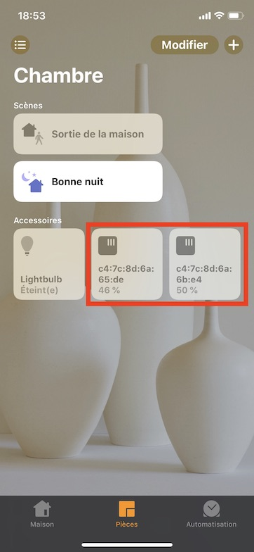
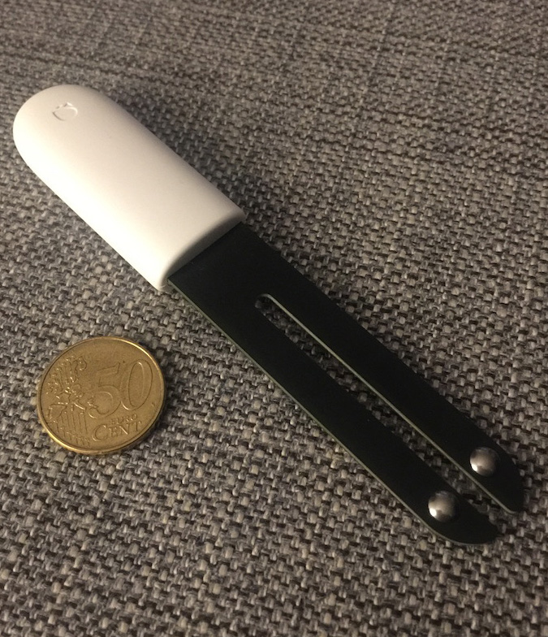

# homebridge-xiaomi-plant-monitor-improved

[](https://github.com/grego360/homebridge-xiaomi-plant-monitor/actions/workflows/build.yml)

This is a [Homebridge](https://github.com/homebridge/homebridge) plugin for exposing
the Xiaomi Flower Care / Flower Mate / Flower Monitor / Mi Flora plant sensors to HomeKit.

It automatically discovers your Mi Flora sensors and adds them to your HomeKit setup with moisture and battery information.

 

## Features

- Automatic discovery of Mi Flora plant sensors
- Displays moisture level as a humidity sensor in HomeKit
- Shows battery level and low battery status
- Optional temperature sensor display
- Optional light level sensor display
- Optional fertility sensor display
- Configurable low battery threshold
- Regular background updates of plant data
- Written in TypeScript for better reliability

## Requirements

- Homebridge v1.4.0 or newer
- Node.js v16 or newer
- Bluetooth hardware support

## Prerequisites

This plugin uses Bluetooth to communicate with Mi Flora devices. You'll need to install the required dependencies for your platform:

### Linux (Ubuntu/Debian/Raspbian)

```bash
sudo apt-get install bluetooth bluez libbluetooth-dev libudev-dev
```

### macOS

No additional dependencies required, but you may need to ensure Bluetooth is enabled.

### Windows

No additional dependencies required, but you may need to ensure Bluetooth is enabled.

## Installation

Install the plugin through Homebridge UI or with npm:

```bash
npm install -g homebridge-xiaomi-plant-monitor-improved
```

## Configuration

Add the platform to your Homebridge `config.json` file:

```json
"platforms": [
    {
        "platform": "xiaomi-plant-monitor",
        "fetchDataIntervalInMs": 3600000,
        "displayTemperature": true,
        "displayLightLevel": true,
        "displayFertility": true,
        "lowBatteryThreshold": 10
    }
]
```

### Configuration Options

| Option                  | Default | Description                                                     |
| ----------------------- | ------- | --------------------------------------------------------------- |
| `fetchDataIntervalInMs` | 3600000 | Interval in milliseconds between data updates (default: 1 hour) |
| `displayTemperature`    | true    | Whether to display temperature sensors in HomeKit               |
| `displayLightLevel`     | true    | Whether to display light level sensors in HomeKit               |
| `displayFertility`      | true    | Whether to display fertility sensors in HomeKit                 |
| `lowBatteryThreshold`   | 10      | Battery percentage threshold for low battery warnings           |

## Troubleshooting

### Bluetooth Issues

If your device is not being discovered:

1. Ensure Bluetooth is enabled on your system
2. Check that the Mi Flora device has a working battery
3. Try placing the Homebridge server closer to the Mi Flora device
4. Make sure the sensor prongs are properly inserted into the soil for accurate moisture readings
5. Consider manually specifying device addresses in your config if auto-discovery fails
6. Restart the Homebridge service

### Manual Device Configuration

If automatic discovery isn't working, you can manually specify your devices:

```json
"platforms": [
    {
        "platform": "xiaomi-plant-monitor",
        "name": "Plant Monitor",
        "fetchDataIntervalInMs": 7200000,
        "devices": [
            {
                "address": "c4:7c:8d:6c:09:00",
                "name": "Monstera Plant"
            }
        ]
    }
]
```

### Debug Logs

To enable debug logs, start Homebridge with the debug flag:

```bash
DEBUG=homebridge-xiaomi-plant-monitor-improved homebridge
```

## Development

This plugin has been converted from JavaScript to TypeScript in version 3.1.0 to improve type safety and developer experience.

### Building from Source

```bash
# Clone the repository
git clone https://github.com/grego360/homebridge-xiaomi-plant-monitor.git
cd homebridge-xiaomi-plant-monitor

# Install dependencies
npm install

# Build the TypeScript code
npm run build

# Watch mode for development
npm run watch
```

## Contributing

Contributions are welcome! Please feel free to submit a Pull Request.

## License

ISC
